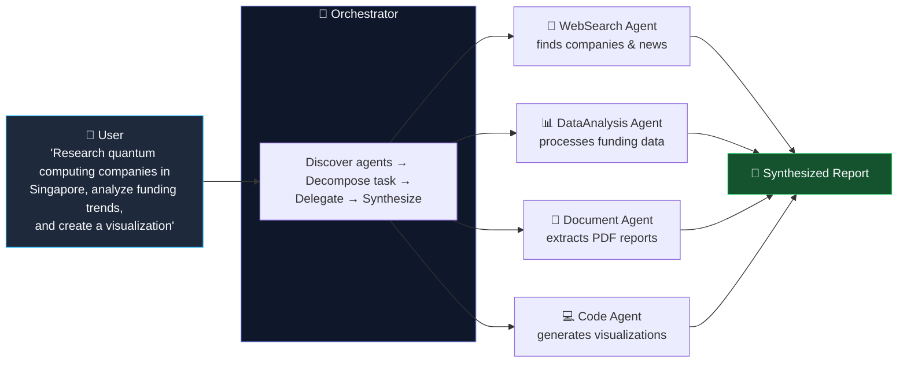
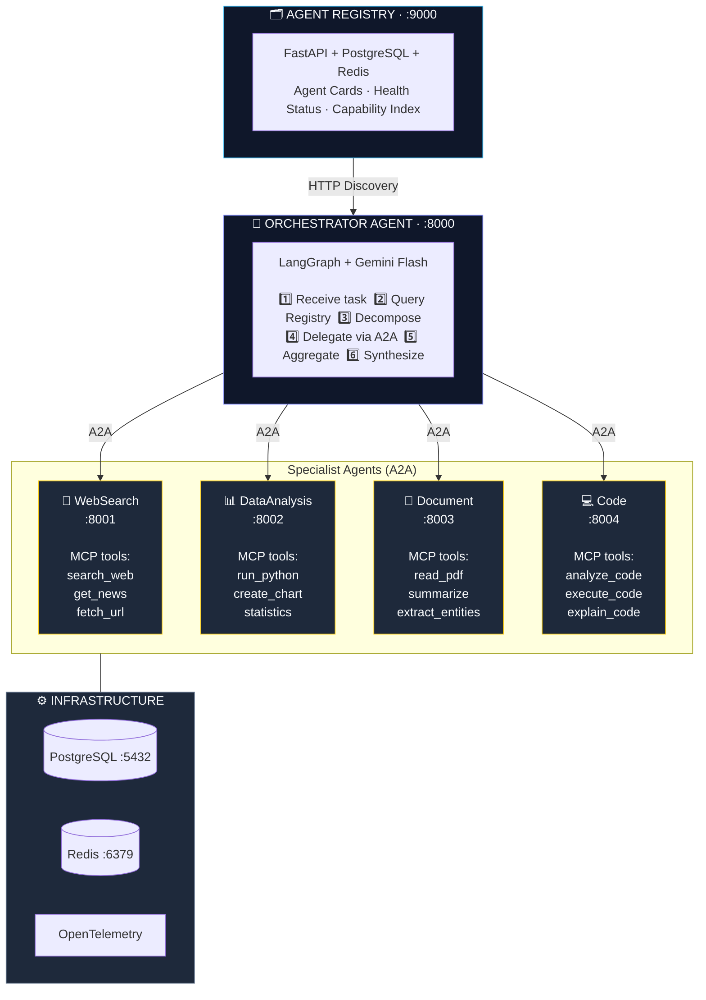
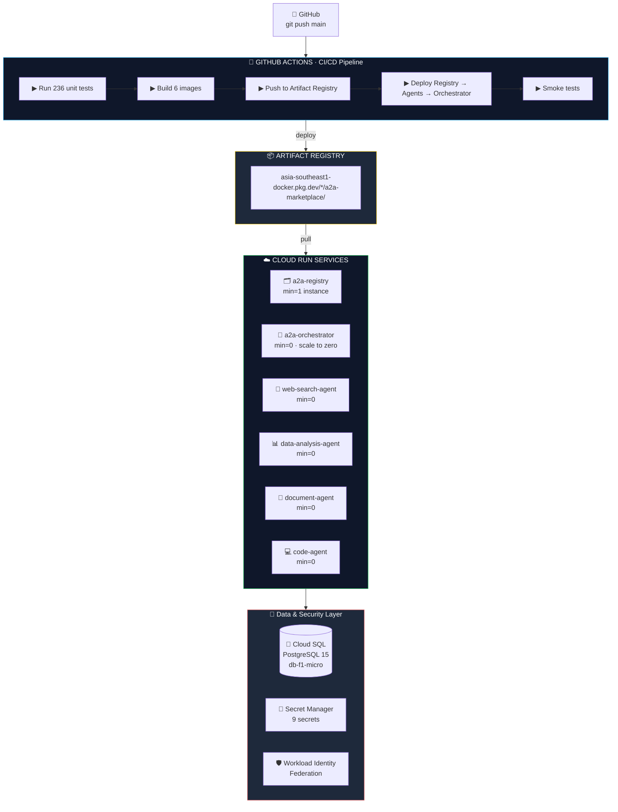
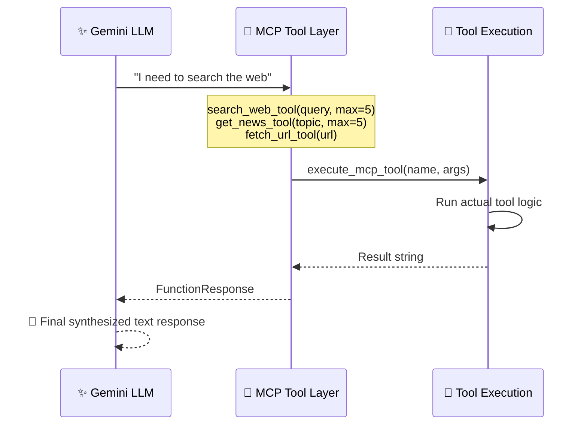
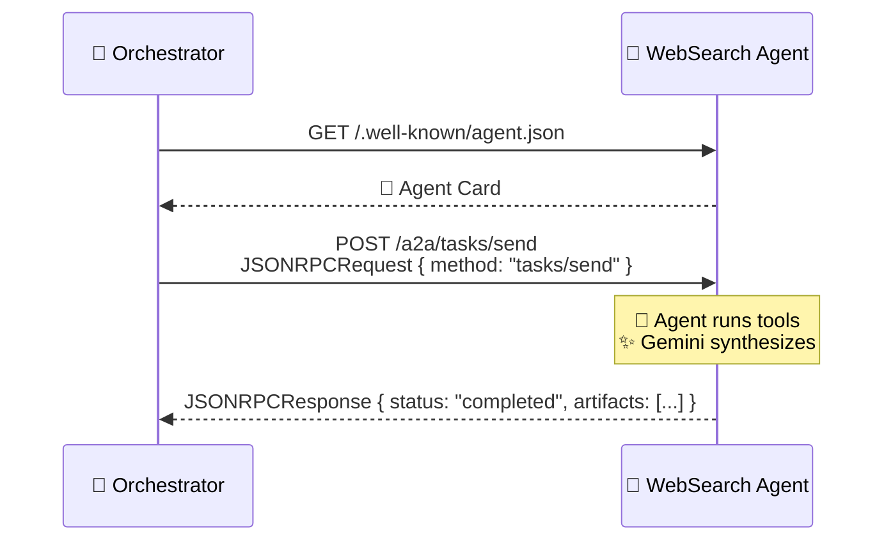
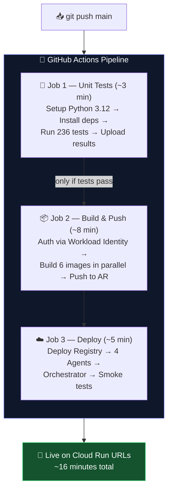
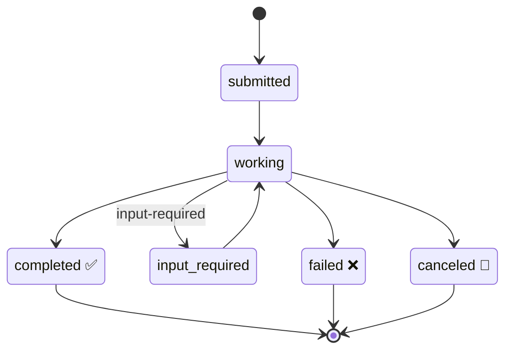
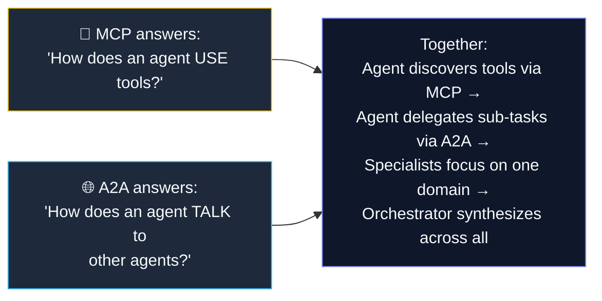

<div align="center">

# ⚡ A2A Multi-Agent Marketplace

### 🧠 A production-grade multi-agent system where AI agents **discover** 🔎, **negotiate** 🤝, and **collaborate** 🚀 using Google's Agent-to-Agent (A2A) protocol and Anthropic's Model Context Protocol (MCP).

<br/>

[](https://python.org)
[](https://fastapi.tiangolo.com)
[](https://ai.google.dev)
[](https://modelcontextprotocol.io)
[](https://docker.com)
[](https://cloud.google.com/run)
[](.github/workflows/deploy.yml)
[](./tests)
[](./LICENSE)

<br/>

**[📖 Overview](#-overview)** · **[🏗️ Architecture](#️-architecture)** · **[🔌 Protocols](#-protocols)** · **[🤖 Agents](#-specialist-agents)** · **[⚡ Quick Start](#-quick-start)** · **[☁️ Cloud Deployment](#️-cloud-deployment)** · **[📡 API Reference](#-api-reference)** · **[🎬 Demo](#-demo-scenarios)**

</div>

<br/>

---

## 📖 Overview

> [!NOTE]
> This project implements two of the most important emerging protocols in the AI industry — side by side, in production form, running live on Google Cloud Run.

| Protocol | ⚙️ By | 🎯 Purpose |
|:---|:---|:---|
| 🌐 **A2A** — Agent-to-Agent | Google · April 2025 | Standardizes how AI agents **discover** and **communicate** with each other |
| 🧩 **MCP** — Model Context Protocol | Anthropic | Standardizes how agents **access tools**, resources, and APIs |

Instead of one monolithic AI trying to do everything, this system orchestrates a **marketplace of specialist agents** — each expert at one domain — that collaborate to solve complex, multi-step tasks.



<br/>

---

## 🏗️ Architecture

### 🐳 Local (Docker Compose)



### ☁️ Production (GCP Cloud Run)



### 📁 Directory Structure

```text
a2a-marketplace/
│
├── 📁 shared/                      # Shared across all services
│   ├── a2a_types.py                # A2A protocol Pydantic models
│   ├── config.py                   # Pydantic v2 settings
│   └── logging_config.py           # Structured logging (structlog)
│
├── 📁 agents/
│   ├── 📁 base/                    # Reusable A2A base class
│   │   └── a2a_server.py
│   │
│   ├── 📁 web_search/              # ✅ Complete
│   │   ├── tools.py                # search_web, get_news, fetch_url
│   │   ├── mcp_server.py           # MCPServer 2.0 tool definitions
│   │   ├── main.py                 # FastAPI A2A service
│   │   └── Dockerfile              # Production container
│   │
│   ├── 📁 data_analysis/           # ✅ pandas + matplotlib
│   ├── 📁 document/                # ✅ PDF + DOCX processing
│   └── 📁 code/                    # ✅ Code generation + execution
│
├── 📁 orchestrator/                # ✅ LangGraph orchestration
│   ├── a2a_client.py               # A2A protocol HTTP client
│   ├── task_decomposer.py          # LLM-powered task planning
│   ├── main.py                     # FastAPI service
│   └── Dockerfile
│
├── 📁 registry/                    # ✅ Agent discovery service
│   ├── models.py                   # Pydantic models
│   ├── database.py                 # Async asyncpg pool
│   ├── main.py                     # Registry FastAPI service
│   └── Dockerfile
│
├── 📁 tests/                       # ✅ 236 tests, all passing
│   ├── test_web_search_mcp.py      # 25 tests
│   ├── test_data_analysis.py       # 40 tests
│   ├── test_document.py            # 41 tests
│   ├── test_code.py                # 41 tests
│   ├── test_registry.py            # 33 tests
│   ├── test_orchestrator.py        # 32 tests
│   └── test_e2e.py                 # 24 E2E tests
│
├── 📁 deploy/                      # ☁️ Cloud Run configurations
│   └── cloudrun/                   # Service definitions
│
├── 📁 scripts/                     # 🛠️ Deployment automation
│   ├── setup_gcp.sh                # GCP infrastructure
│   ├── setup_secrets.sh            # Secret Manager
│   └── setup_workload_identity.sh  # GitHub Actions auth
│
├── 📁 .github/workflows/           # 🤖 CI/CD pipeline
│   └── deploy.yml                  # Test → Build → Deploy
│
├── 🐳 docker-compose.yml           # Full local system
├── 🐳 docker-compose.dev.yml       # Dev overrides (hot reload)
├── 📄 Makefile                     # Convenient commands
└── 📦 pyproject.toml               # Single dependency source
```

<br/>

---

## 🔌 Protocols

### 🧩 MCP — Model Context Protocol



Each specialist agent exposes its capabilities as **MCP tools** using `MCPServer` from the `mcp` SDK 2.0. Tools are defined with type-hinted Python functions — the SDK generates JSON schemas automatically.

```python
from mcp.server.mcpserver import MCPServer

mcp = MCPServer("web-search-agent", version="1.0.0")

@mcp.tool()
async def search_web_tool(query: str, max_results: int = 5) -> str:
    """Search the web for current information on any topic."""
    results = await search_web(query=query, max_results=max_results)
    return format_results(results)
```

<br/>

### 🌐 A2A — Agent-to-Agent Protocol



Every agent serves an **Agent Card** at `/.well-known/agent.json` — a machine-readable manifest describing capabilities, skills, and authentication requirements. The orchestrator reads these cards to make intelligent delegation decisions.

<br/>

---

## 🤖 Specialist Agents

### 🔎 Web Search Agent · `:8001` ✅

> Searches the web, fetches news, and reads URLs using a multi-provider fallback chain.

| 🛠️ Tool | 📋 Description | 🔌 Provider |
|:---|:---|:---|
| `search_web_tool` | General web search with snippet extraction | Google CSE → ddgs |
| `get_news_tool` | Recent news articles with dates and sources | ddgs News |
| `fetch_url_tool` | Full page content extraction, HTML stripped | httpx + BeautifulSoup |

<br/>

### 📊 Data Analysis Agent · `:8002` ✅

> Runs Python code, generates charts, and performs statistical analysis on structured data.

| 🛠️ Tool | 📋 Description |
|:---|:---|
| `run_python_code` | Execute Python in a sandboxed environment |
| `create_chart` | Generate matplotlib visualizations (bar, line, scatter, histogram, pie) |
| `statistical_analysis` | Descriptive stats: mean, median, std, percentiles, IQR |

<br/>

### 📄 Document Agent · `:8003` ✅

> Reads and extracts structured information from PDF, DOCX, and web URLs.

| 🛠️ Tool | 📋 Description |
|:---|:---|
| `extract_text` | Extract text from PDF, DOCX, TXT files, or web URLs |
| `summarize_document` | AI-powered summaries (concise, detailed, bullet, executive) |
| `extract_entities` | Extract emails, URLs, dates, names, organizations |

<br/>

### 💻 Code Agent · `:8004` ✅

> Analyzes, executes, and explains Python code with sandboxed execution.

| 🛠️ Tool | 📋 Description |
|:---|:---|
| `analyze_code` | AST-based analysis + complexity grading (A-F) via radon |
| `execute_code` | Sandboxed subprocess execution with timeout + memory limits |
| `explain_code` | AI-powered explanations with improvement suggestions |

<br/>

---

## ⚡ Quick Start

### ✅ Prerequisites

```bash
# Required
Python 3.12+
Docker (native Linux or WSL2)
Git

# Get a free Gemini API key
# → https://aistudio.google.com/apikey
```

### 📦 Installation

```bash
# 1️⃣ Clone the repository
git clone https://github.com/laspraharshana/a2a-marketplace.git
cd a2a-marketplace

# 2️⃣ Create virtual environment
python3 -m venv .venv
source .venv/bin/activate

# 3️⃣ Install all dependencies
pip install -e ".[web-search,data-analysis,document,code,dev]"

# 4️⃣ Configure environment
cp .env.example .env
# Edit .env with your API keys
nano .env
```

### 🔐 Environment Configuration

```ini
# .env — minimum required configuration
GOOGLE_API_KEY=your_gemini_api_key_here
AGENT_MODEL=gemini-flash-lite-latest
ORCHESTRATOR_MODEL=gemini-flash-latest
A2A_BEARER_TOKEN=your-secret-token-here
```

### 🐳 Run the Full System Locally

```bash
# Start all services with Docker Compose
make up

# Or manually:
docker compose up --build
```

| 🧩 Service | 🌐 URL |
|:---|:---|
| 🗂️ Agent Registry | `http://localhost:9000` |
| 🧭 Orchestrator | `http://localhost:8000` |
| 🔎 Web Search Agent | `http://localhost:8001` |
| 📊 Data Analysis | `http://localhost:8002` |
| 📄 Document Agent | `http://localhost:8003` |
| 💻 Code Agent | `http://localhost:8004` |

### 🧪 Run Tests

```bash
# All unit tests (fast)
make test

# Full E2E tests (requires Docker stack running)
make test-e2e

# Check service health
make status

# Live demo
make demo
```

<br/>

---

## ☁️ Cloud Deployment

This project runs in production on **Google Cloud Platform** with fully automated CI/CD.

### 🏗️ GCP Architecture

| ☁️ Service | 🎯 Purpose | 💰 Cost |
|:---|:---|:---:|
| ☁️ Cloud Run | Serverless containers (6 services) | Free tier |
| 🐘 Cloud SQL | Managed PostgreSQL (db-f1-micro) | ~$7/mo |
| 📦 Artifact Registry | Docker image storage | ~$0.10/mo |
| 🔐 Secret Manager | API keys, DB passwords, tokens | Free tier |
| 🛡️ Workload Identity | Keyless GitHub Actions auth | Free |

**Total estimated cost: ~$7-8/month** (fully covered by $300 free credits for years)

### 🤖 Automated CI/CD Pipeline

Every push to `main` triggers:



### 🚀 One-Time Setup

```bash
# 1. Install and initialize gcloud
curl https://sdk.cloud.google.com | bash
gcloud init

# 2. Run infrastructure setup
./scripts/setup_gcp.sh

# 3. Load secrets from .env
./scripts/setup_secrets.sh

# 4. Configure GitHub Actions auth
./scripts/setup_workload_identity.sh

# 5. Add printed values to GitHub Secrets:
# https://github.com/laspraharshana/a2a-marketplace/settings/secrets/actions
```

### 📊 Cloud Run Dashboard

**View live services:**
```
https://console.cloud.google.com/run?project=a2a-marketplace
```

**Check service status:**
```bash
# All Cloud Run services
gcloud run services list \
    --region=asia-southeast1 \
    --project=a2a-marketplace

# Or use Make target
make gcp-status

# Get all URLs
make gcp-urls
```

### 🎬 Live GCP Demo

```bash
# Live demo against production
make gcp-demo

# Or manually
ORCH_URL=$(gcloud run services describe a2a-orchestrator \
    --region=asia-southeast1 \
    --project=a2a-marketplace \
    --format="value(status.url)")

curl -X POST $ORCH_URL/orchestrate \
    -H "Content-Type: application/json" \
    -H "Authorization: Bearer $BEARER_TOKEN" \
    -d '{"query": "Search for top 3 AI companies in Singapore"}' \
    | python3 -m json.tool
```

### 🛡️ Security Features

- **🔐 Workload Identity Federation** — no service account keys stored in GitHub
- **🔒 Secret Manager** — all API keys and passwords encrypted at rest
- **🚫 Private agents** — specialist agents require Bearer token (no public access)
- **🌐 Public orchestrator + registry** — only entry points exposed
- **🛡️ Cloud SQL private connection** — via Cloud SQL Unix socket
- **⏱️ Automatic scaling** — agents scale to zero when idle

<br/>

---

## 📡 API Reference

### 🌐 A2A Standard Endpoints

Every agent exposes the same A2A-compliant interface:

#### `GET /.well-known/agent.json`
Returns the Agent Card — no authentication required.

```bash
curl http://localhost:8001/.well-known/agent.json
```

#### `GET /health`
Health check for load balancers and orchestration.

```bash
curl http://localhost:8001/health
# → {"status": "healthy", "agent": "web-search-agent", "version": "1.0.0"}
```

#### `POST /a2a/tasks/send`
Send a task to the agent. Requires Bearer token. 🔒

```bash
curl -X POST http://localhost:8001/a2a/tasks/send \
  -H "Content-Type: application/json" \
  -H "Authorization: Bearer your-token" \
  -d '{
    "jsonrpc": "2.0",
    "id": "req-001",
    "method": "tasks/send",
    "params": {
      "id": "task-001",
      "message": {
        "role": "user",
        "parts": [{"type": "text", "text": "Search for AI startups in Singapore"}]
      }
    }
  }'
```

**📥 Response:**
```json
{
  "jsonrpc": "2.0",
  "id": "req-001",
  "result": {
    "id": "task-001",
    "status": { "state": "completed" },
    "artifacts": [{
      "name": "search_results",
      "parts": [{"type": "text", "text": "Based on search results..."}]
    }]
  }
}
```

### 🔄 Task State Machine



<br/>

---

## 🎬 Demo Scenarios

### 1️⃣ Market Research 📈

```bash
curl -X POST http://localhost:8000/orchestrate \
  -H "Authorization: Bearer your-token" \
  -d '{
    "query": "Research quantum computing companies in Singapore,
             find their funding data, and summarize the landscape"
  }'
```

**Orchestrator delegates:** 🔎 WebSearch Agent finds companies → 📊 DataAnalysis Agent processes funding data → 🧵 Synthesizes comprehensive report.

<br/>

### 2️⃣ Code Analysis 💻

```bash
curl -X POST http://localhost:8000/orchestrate \
  -H "Authorization: Bearer your-token" \
  -d '{
    "query": "Explain what this Python code does and analyze complexity:
              def bubble_sort(arr): ..."
  }'
```

**Orchestrator delegates:** 💻 Code Agent analyzes AST + complexity → 💻 Code Agent generates explanation → 🧵 Synthesizes complete analysis.

<br/>

### 3️⃣ Live News Analysis 📰

```bash
curl -X POST http://localhost:8001/a2a/tasks/send \
  -H "Authorization: Bearer your-token" \
  -d '{
    "jsonrpc": "2.0",
    "id": "demo-001",
    "method": "tasks/send",
    "params": {
      "id": "task-demo-001",
      "message": {
        "role": "user",
        "parts": [{"type": "text",
          "text": "Search for top 3 AI companies in Singapore"}]
      }
    }
  }'
```

> [!TIP]
> **Actual response (live from Cloud Run):**
>
> Based on search results, top AI companies in Singapore include:
>
> 1. **PatSnap** — AI-powered IP and R&D intelligence platform, NUS alumni founded, recognized unicorn
> 2. **Advance Intelligence Group (ADVANCE.AI)** — Leading AI-driven big data and digital identity verification
> 3. **AI Singapore (AISG)** — National R&D program developing foundational AI models including Sea-Lion
>
> *Sources: Built In Singapore, Second Talent, International Business Times*

<br/>

---

## 🛠️ Tech Stack

| 🧱 Layer | 🔧 Technology | 🏷️ Version | 🎯 Purpose |
|:---|:---|:---|:---|
| Protocol | 🌐 A2A (Google) | April 2025 | Agent-to-agent communication |
| Protocol | 🧩 MCP (Anthropic) | 2.0 | Tool and resource access |
| LLM | ✨ Google Gemini | Flash / Flash Lite | Reasoning and synthesis |
| Framework | ⚡ FastAPI | 0.115 | Agent HTTP services |
| Agent Logic | 🕸️ LangGraph | 0.2 | Orchestrator graph execution |
| MCP SDK | 🧩 mcp | 2.0.0 | MCPServer tool definitions |
| Gemini SDK | ✨ google-genai | 2.16.0 | LLM API client |
| Database | 🐘 PostgreSQL | 15 | Task history, agent registry |
| Search | 🔎 ddgs | 9+ | Free web search fallback |
| Validation | 🛡️ Pydantic | v2 | Type safety throughout |
| Logging | 📝 structlog | 24+ | Structured JSON logging |
| Testing | 🧪 pytest | 8.2 | 236 tests, async support |
| Container | 🐳 Docker | 29.1.3 | Microservice deployment |
| Cloud | ☁️ Google Cloud Run | Latest | Serverless containers |
| CI/CD | 🤖 GitHub Actions | v4 | Automated test + deploy |
| Auth | 🛡️ Workload Identity | Latest | Keyless GCP authentication |

<br/>

---

## 🧠 Key Design Decisions

### ❓ Why A2A + MCP Together?



### ❓ Why Cloud Run + Serverless?

Cloud Run with `min-instances=0` gives:
- 💰 **Pay only when handling requests**
- 📈 **Auto-scales up** under load
- 🌍 **Global by default** (asia-southeast1 for latency)
- 🚀 **No cluster management** overhead
- 🔐 **Managed TLS, secrets, IAM**

### ❓ Why Separate Microservices?

Each agent runs as an independent FastAPI service:
- 📈 **Independent scaling** — search used 10x more than others
- 🚀 **Independent deployment** — update one without restarting the rest
- 🛡️ **Independent failure** — one agent down ≠ system down
- 🌍 **Language agnostic** — A2A is plain HTTP

<br/>

---

## 📊 Project Status

| 🧩 Component | 🚦 Status | 🧪 Tests | ☁️ GCP |
|:---|:---:|:---:|:---:|
| 🔎 Web Search Agent | ✅ Complete | 25/25 | ✅ Deployed |
| 📊 Data Analysis Agent | ✅ Complete | 40/40 | ✅ Deployed |
| 📄 Document Agent | ✅ Complete | 41/41 | ✅ Deployed |
| 💻 Code Agent | ✅ Complete | 41/41 | ✅ Deployed |
| 🗂️ Agent Registry | ✅ Complete | 33/33 | ✅ Deployed |
| 🧭 Orchestrator | ✅ Complete | 32/32 | ✅ Deployed |
| 🐳 Docker Compose | ✅ Complete | — | — |
| 🌐 E2E Tests | ✅ Complete | 24/24 | ✅ Passing |
| 🤖 GitHub Actions | ✅ Complete | — | ✅ Live |

**Total: 236 tests passing · 6 services deployed on GCP Cloud Run**

<br/>

---

## 🤝 Contributing

This is an active portfolio project. Architecture decisions and protocol implementations follow the official specs:

- 🌐 [A2A Protocol Spec](https://github.com/google-a2a/A2A)
- 🧩 [MCP Specification](https://modelcontextprotocol.io)
- ✨ [Gemini API Docs](https://ai.google.dev/docs)

<br/>

---

## 📄 License

MIT License — see [LICENSE](./LICENSE) for details.

---

<div align="center">

### 🔥 Built with bleeding-edge AI protocols

`🌐 A2A` · `🧩 MCP` · `✨ Gemini` · `⚡ FastAPI` · `🕸️ LangGraph` · `☁️ Cloud Run`

*The future of AI is agents that work together.* 🤖🤝🤖

**⭐ Star this repo if you find it useful!**

</div>
